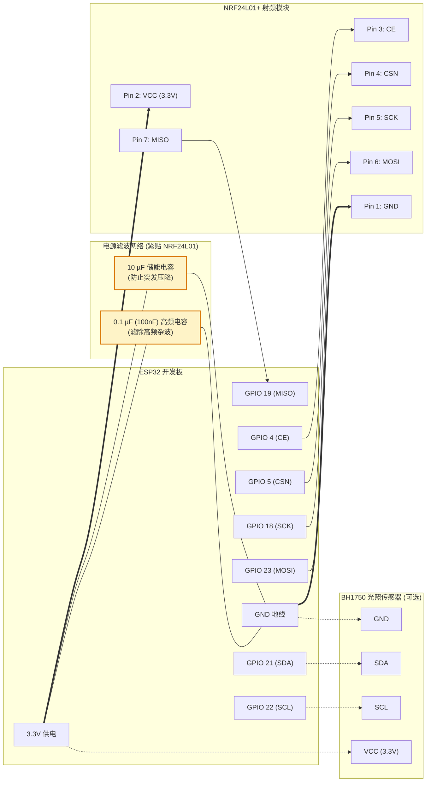

# Xiaomi Lightbar with Home Assistant (ESPHome)

[English](README_en.md) | [中文](README.md)

[](https://esphome.io)
[](https://www.home-assistant.io)
[](https://opensource.org/licenses/MIT)

通过 ESP32 + NRF24L01 射频模块，将**米家屏幕挂灯（Xiaomi Mijia Monitor Lightbar）**完美接入 **Home Assistant** 与 **ESPHome**。

支持亮度调节、冷暖色温无极/梯级调节、开关控制，并具备**原装无线旋钮遥控器 ID 嗅探**与**旋钮状态双向同步**功能。另外还集成了 **BH1750 桌面照度传感器**，方便实现桌面自动调光联动。

---

## ✨ 核心特性

- 💡 **原生双色温灯实体（CWWW）**：在 Home Assistant 中直接作为标准冷暖灯展现（2000K - 6500K），支持无缝调光与滑动条调节。
- 📡 **无需对码重置（免拆免重连）**：内置 2.4GHz 射频嗅探器，点击一键嗅探即可捕获原配旋钮的 `Remote ID`，原装旋钮与 HA 可**同时共存**控制挂灯。
- 🔄 **原装旋钮双向同步**：后台低功耗高频监听旋钮动作，按压实体旋钮开关灯时，Home Assistant 状态实时同步更新，避免状态不同步。
- ⚡ **智能防抖与射频优化**：采用 50ms 聚合防抖与打底唤醒机制（先打底包再发目标步进），调光顺滑不丢包。
- 📈 **集成环境光传感器（BH1750）**：板载/外接照度检测，带滤波和死区阈值上报，助力打造根据桌面光线自动调光的智能桌面。

---

## 🛠️ 硬件清单与接线

### 1. 硬件准备

- **ESP32 开发板**（如 ESP32 DevKit / NodeMCU-32S / ESP32-WROOM 或 Apollo ESK-1）
- **NRF24L01+ 2.4GHz 射频收发模块**（带天线版本信号更强）
- **滤波去耦电容**：
  - **10 µF**（电解电容或钽电容，负责瞬态低频大电流储能，防止发射时拉低电压）
  - **0.1 µF / 100 nF**（独石/贴片陶瓷电容，负责高频去耦滤波，滤除高频杂波）
- **BH1750 光照传感器**（I2C 接口，可选）
- 杜邦线若干

### 2. 引脚接线定义

#### NRF24L01 ↔ ESP32

| NRF24L01 引脚 | ESP32 GPIO | 说明 |
| :--- | :--- | :--- |
| **VCC** | **3.3V** | ⚠️ **切勿接 5V**！紧贴引脚**并联 10µF + 0.1µF 电容**到 GND |
| **GND** | **GND** | 共地 |
| **CE** | **GPIO 4** | 芯片使能 |
| **CSN** | **GPIO 5** | SPI 片选 |
| **SCK** | **GPIO 18** | SPI 时钟 |
| **MOSI** | **GPIO 23** | SPI 主出从入 |
| **MISO** | **GPIO 19** | SPI 主入从出（嗅探与接收旋钮信号必需） |
| **IRQ** | - | 悬空不接（NC） |

#### BH1750 光照传感器 ↔ ESP32（可选）

| BH1750 引脚 | ESP32 GPIO | 说明 |
| :--- | :--- | :--- |
| **VCC** | **3.3V** | 供电 |
| **GND** | **GND** | 接地 |
| **SDA** | **GPIO 21** | I2C 数据 |
| **SCL** | **GPIO 22** | I2C 时钟 |

> [!NOTE]
> 如需修改引脚，可在 `xiaomi-lightbar.yaml`（针对 I2C）以及 `xiaomi_lightbar.h` 末尾的 `get_lightbar()` 实例化处修改。

### 3. 接线示意图与电源滤波方案

NRF24L01 对供电纹波和瞬态压降极其敏感，突发发射时电流较大。**强烈建议在 NRF24L01 的 VCC 与 GND 引脚根部并联一个 10µF 电容和一个 0.1µF 电容**：

```text
               ┌───────────────────────┐
               │    NRF24L01 模块      │
               │                       │
               │   1:GND       2:VCC   │
               │   3:CE        4:CSN   │
               │   5:SCK       6:MOSI  │
               │   7:MISO      8:IRQ   │
               └───────┬───────────┬───┘
                       │           │
ESP32 GND ─────────────┴──┬─────┬──┘
                          │     │
                 [10µF 电解]   [0.1µF 瓷片]
                          │     │
ESP32 3.3V ───────────────┴─────┴──────> NRF24L01 Pin 2 (VCC)
```

#### 完整连接拓扑图 (Mermaid)



---

## 🚀 快速上手

### 第一步：准备 ESPHome 配置文件

1. 将本项目克隆或下载到你的 ESPHome 配置目录（如 Home Assistant 的 `/config/esphome/` 下）：
   ```bash
   git clone https://github.com/Benature/xiaomi-lightbar-with-ha.git
   ```

2. 确保在 `secrets.yaml` 中配置了你的 WiFi 信息和加密密钥：
   ```yaml
   wifi_ssid: "Your_WiFi_SSID"
   wifi_password: "Your_WiFi_Password"
   esp32_light_sensor__encryption_key: "Your_ESPHome_API_Key"
   ```

3. 首次编译烧录：
   - 保持 `xiaomi_lightbar.h` 默认的 ID（`0xABCDEF`），使用 ESPHome Dashboard 或命令行将 `xiaomi-lightbar.yaml` 编译并刷入 ESP32。

---

### 第二步：获取/配对挂灯 ID

本项目提供两种接入挂灯的方式，**强烈推荐使用【方法 A】**：

#### 方法 A：嗅探实体旋钮 ID（推荐，原装旋钮与 HA 共存）

1. 打开 Home Assistant，在自动发现的 ESPHome 设备控制面板中找到 **"Sniff Remote ID"**（嗅探实体遥控器 ID）按钮。
2. 点击该按钮，ESPHome 将开启 20 秒信道跳频嗅探模式。
3. 打开 ESPHome 日志（Logs）。
4. **立即快速旋转或按压米家原配的实体无线旋钮**。
5. 查看日志输出，当捕获成功后会打印：
   ```text
   [W][sniffer:248]: ****************************************
   [W][sniffer:249]: 🎉 成功捕获实体遥控器！
   [W][sniffer:250]: 🎯 你的真实 Remote ID: 0x123456
   [W][sniffer:251]: ****************************************
   ```
6. 打开 `xiaomi_lightbar.h`，定位到文件最底部，将捕获到的 ID 替换进代码：
   ```cpp
   inline XiaomiLightbar &get_lightbar() {
     // 将 0xABCDEF 替换为你抓到的真实 Remote ID，例如 0x123456
     static XiaomiLightbar bar(4, 5, 18, 23, 19, 0x123456);
     return bar;
   }
   ```
7. 重新编译并通过 OTA 推送到 ESP32。
8. 大功告成！此时 Home Assistant 与原配实体旋钮均可无缝控制挂灯，且实体旋钮的操作会双向同步到 HA！

---

#### 方法 B：对码重置（仅当没有原配旋钮或打算单独使用时）

1. 在 `xiaomi_lightbar.h` 中指定任意一个你喜欢的 24-bit 伪随机 ID（如 `0x112233`）。
2. 将米家挂灯断电，重新插上电源。
3. 在挂灯通电后的几秒钟内，点击 Home Assistant 页面上的 **"Pair Xiaomi Lightbar"** 按钮发送对码广播包。
4. 挂灯呼吸闪烁即表示对码成功。

---

## 🖥️ Home Assistant 效果与实体

接入成功后，在 Home Assistant 中将生成以下实体：

| 实体名 | 平台 / 类型 | 说明 |
| :--- | :--- | :--- |
| `light.xiaomi_monitor_lightbar` | `light` (CWWW) | 挂灯主控实体（开关、亮度 1-100%、色温 2000K-6500K） |
| `sensor.desk_illuminance` | `sensor` (lx) | 桌面照度数据，自动平滑过滤 |
| `button.toggle_lightbar_rf_power` | `button` | 手动翻转挂灯射频电源（断电或状态错位时一键校准） |
| `button.sniff_remote_id` | `button` | 启动 20s 嗅探原装旋钮通信 ID |
| `button.pair_xiaomi_lightbar` | `button` | 发送配对/重置数据包 |

---

## 💡 自动化联动灵感

利用集成的 `BH1750` 照度传感器和挂灯实体，可以在 Home Assistant 中轻松实现自动化：

- **根据桌面照度自动补光**：办公区有人且照度低于 `150 lx` 时自动开灯，并根据时间段自适应调节色温。
- **离开工位自动关灯**：配合人体存在传感器（如雷达），离开座位 5 分钟后自动淡出关灯。
- **实体旋钮双向响应**：即使在 HA 关机或断网重启后，按压原装旋钮也能立即同步 HA 状态。

---

## ❓ 常见问题排查 (FAQ)

<details>
<summary><b>Q: 嗅探不到实体遥控器 ID？</b></summary>

1. **检查 MISO 接线**：嗅探必须依赖 MISO（GPIO 19）正常接收数据，如果 MISO 虚焊或断开，将只能发送不能接收。
2. **缩短距离与多转动**：嗅探时间为 20 秒，点击按钮后请将遥控器靠近 NRF 模块并快速持续旋转。
3. **供电滤波**：NRF24L01 对 3.3V 电源纹波与瞬态压降极为敏感，如经常通信失败或偶尔丢包，请务必紧贴 NRF24L01 的 VCC 和 GND 引脚并联一颗 **10µF** 储能电容和一颗 **0.1µF (100nF)** 高频瓷片电容。
</details>

<details>
<summary><b>Q: 调节全暖光（最低色温）时挂灯无响应？</b></summary>

本项目已在 `xiaomi_lightbar.h` 中加入了针对零步进（0-step）的底包与激活包修复（`0x02F0` 打底后补发 `0x0200` 触发包），完美支持 0~15 全范围阶梯调光和极暖光输出。
</details>

---

## 🙏 致谢 (Acknowledgments)

本项目射频逆向协议与通信指令参考并受益于以下优秀开源项目，在此深表感谢：

- [lamperez/xiaomi-lightbar-nrf24](https://github.com/lamperez/xiaomi-lightbar-nrf24.git) - 提供了米家屏幕挂灯 2.4GHz 射频协议、报文结构与 CRC16 算法的基础逆向工程研究。

---

## 📜 许可证

本项目基于 [MIT License](LICENSE) 开源。
