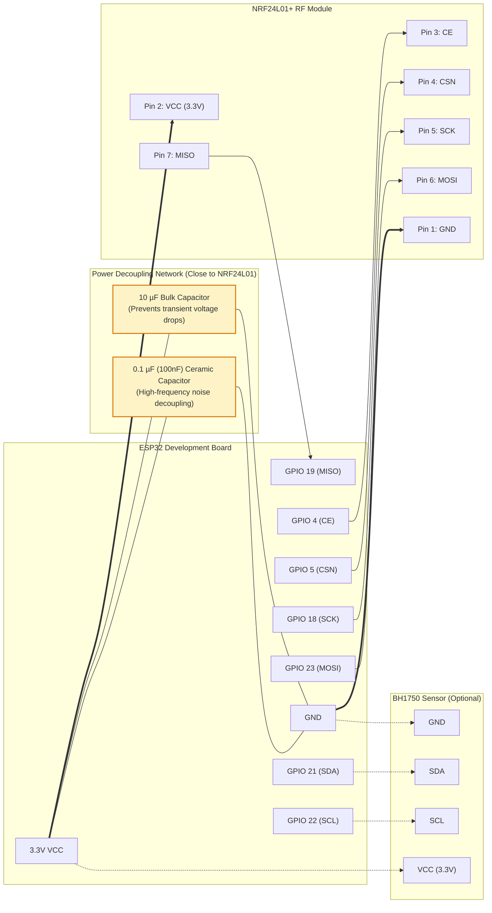

# Xiaomi Lightbar with Home Assistant (ESPHome)

[English](README_en.md) | [中文](README.md)

[](https://esphome.io)
[](https://www.home-assistant.io)
[](https://opensource.org/licenses/MIT)

Integrate the **Xiaomi Mijia Computer Monitor Light Bar (MJGJD01YL)** seamlessly into **Home Assistant** and **ESPHome** using an **ESP32** and an **NRF24L01+** 2.4GHz RF module.

Supports brightness control, stepless/stepped color temperature (CCT) adjustment, power toggle, **original wireless rotary knob Remote ID sniffing**, and **bidirectional status synchronization**. In addition, an optional **BH1750 ambient light sensor** is integrated for automated desk lighting automations.

---

## ✨ Key Features

- 💡 **Native Cold/Warm White Light Entity (CWWW)**: Exposed as a standard CCT tunable white light entity in Home Assistant (2000K - 6500K) with smooth slider adjustment.
- 📡 **No Lightbar Re-pairing Required**: Built-in 2.4GHz channel-hopping sniffer captures the factory `Remote ID` of your existing physical rotary knob in seconds. The original knob and Home Assistant **coexist concurrently**.
- 🔄 **Bidirectional Remote Knob Sync**: Background low-latency polling listens for physical knob presses. Clicking the physical knob immediately updates the light's state in Home Assistant, preventing desynchronization.
- ⚡ **Optimized RF Transmission & Debouncing**: 50ms aggregation debounce, instant zero-transition dispatch, and step activation fix ensure robust packet delivery without dropping signals.
- 📈 **Integrated Ambient Light Sensor (BH1750)**: Onboard/external illuminance monitoring with sliding average filtering and threshold deadbands for automated desk illuminance control.

---

## 🛠️ Hardware Requirements & Wiring

### 1. Bill of Materials

- **ESP32 Development Board** (e.g., ESP32 DevKit, NodeMCU-32S, ESP32-WROOM, or Apollo ESK-1)
- **NRF24L01+ 2.4GHz RF Transceiver Module** (PA+LNA external antenna version recommended for maximum range)
- **Decoupling / Filter Capacitors**:
  - **10 µF** (Electrolytic or Tantalum capacitor, provides bulk energy storage to prevent instantaneous voltage drops during RF bursts)
  - **0.1 µF / 100 nF** (Ceramic capacitor, filters out high-frequency noise and ripples)
- **BH1750 Ambient Light Sensor** (I2C interface, optional)
- Dupont jumper wires

### 2. Pinout Connections

#### NRF24L01+ ↔ ESP32

| NRF24L01+ Pin | ESP32 Pin | Notes |
| :--- | :--- | :--- |
| **VCC** | **3.3V** | ⚠️ **DO NOT connect to 5V!** Connect **10µF + 0.1µF capacitors in parallel** right across VCC & GND pins |
| **GND** | **GND** | Common Ground |
| **CE** | **GPIO 4** | Chip Enable |
| **CSN** | **GPIO 5** | SPI Chip Select |
| **SCK** | **GPIO 18** | SPI Clock |
| **MOSI** | **GPIO 23** | SPI Master Out Slave In |
| **MISO** | **GPIO 19** | SPI Master In Slave Out (required for sniffing & knob sync) |
| **IRQ** | - | Not connected (NC) |

#### BH1750 Ambient Light Sensor ↔ ESP32 (Optional)

| BH1750 Pin | ESP32 Pin | Notes |
| :--- | :--- | :--- |
| **VCC** | **3.3V** | Power supply |
| **GND** | **GND** | Ground |
| **SDA** | **GPIO 21** | I2C Data |
| **SCL** | **GPIO 22** | I2C Clock |

> [!NOTE]
> If you need to customize pins, modify them in `xiaomi-lightbar.yaml` (for I2C) and at the bottom instantiation `get_lightbar()` in `xiaomi_lightbar.h`.

### 3. Wiring Diagram & Power Decoupling Circuit

The NRF24L01+ transceiver is exceptionally sensitive to power supply ripple and instantaneous voltage drops during packet transmission. **It is strongly recommended to solder a 10µF capacitor and a 0.1µF capacitor directly across the VCC and GND pins of the NRF24L01 module**:

```text
               ┌───────────────────────┐
               │    NRF24L01+ Module   │
               │                       │
               │   1:GND       2:VCC   │
               │   3:CE        4:CSN   │
               │   5:SCK       6:MOSI  │
               │   7:MISO      8:IRQ   │
               └───────┬───────────┬───┘
                       │           │
ESP32 GND ─────────────┴──┬─────┬──┘
                          │     │
                 [10µF Bulk]   [0.1µF Ceramic]
                          │     │
ESP32 3.3V ───────────────┴─────┴──────> NRF24L01 Pin 2 (VCC)
```

#### System Interconnection Topology (Mermaid)



---

## 🚀 Quick Start Guide

### Step 1: Prepare ESPHome Configuration

1. Clone or download this repository into your ESPHome configuration directory (e.g. `/config/esphome/` in Home Assistant):
   ```bash
   git clone https://github.com/Benature/xiaomi-lightbar-with-ha.git
   ```

2. Make sure your WiFi credentials and encryption keys are configured in your `secrets.yaml`:
   ```yaml
   wifi_ssid: "Your_WiFi_SSID"
   wifi_password: "Your_WiFi_Password"
   esp32_light_sensor__encryption_key: "Your_ESPHome_API_Key"
   ```

3. Initial compilation & flashing:
   - Keep the placeholder ID (`0xABCDEF`) in `xiaomi_lightbar.h`.
   - Compile and flash `xiaomi-lightbar.yaml` to your ESP32 using the ESPHome dashboard or CLI.

---

### Step 2: Acquire Lightbar Remote ID

This project offers two pairing methods. **Method A is strongly recommended**:

#### Method A: Sniff Original Knob Remote ID (Recommended)

1. Open Home Assistant, locate the automatically discovered ESPHome device card, and find the **"Sniff Remote ID"** button.
2. Click the button to start the 20-second channel-hopping RF sniffing mode.
3. Open the ESPHome live logs (**Logs**).
4. **Immediately rotate and press the original wireless rotary knob continuously**.
5. Check the log output. When captured, you will see:
   ```text
   [W][sniffer:248]: ****************************************
   [W][sniffer:249]: 🎉 成功捕获实体遥控器！
   [W][sniffer:250]: 🎯 你的真实 Remote ID: 0x123456
   [W][sniffer:251]: ****************************************
   ```
6. Open `xiaomi_lightbar.h`, navigate to the very bottom, and replace `0xABCDEF` with your captured Remote ID:
   ```cpp
   inline XiaomiLightbar &get_lightbar() {
     // Replace 0xABCDEF with your actual captured Remote ID:
     static XiaomiLightbar bar(4, 5, 18, 23, 19, 0x123456);
     return bar;
   }
   ```
7. Recompile and upload via OTA to your ESP32.
8. Done! Home Assistant and the original physical knob can now both control the lightbar seamlessly, and knob presses will sync back to Home Assistant in real time!

---

#### Method B: Direct Pairing / Reset (If you do not have the original knob)

1. In `xiaomi_lightbar.h`, specify an arbitrary 24-bit hexadecimal ID (such as `0x112233`).
2. Disconnect power from the Xiaomi Lightbar, then plug it back in.
3. Within a few seconds of power-on, click the **"Pair Xiaomi Lightbar"** button in Home Assistant.
4. The lightbar will pulse/breathe, indicating successful pairing.

---

## 🖥️ Home Assistant Entities

Once connected, the following entities will be exposed to Home Assistant:

| Entity ID | Domain / Type | Description |
| :--- | :--- | :--- |
| `light.xiaomi_monitor_lightbar` | `light` (CWWW) | Primary light control (power, brightness 1-100%, color temp 2000K-6500K) |
| `sensor.desk_illuminance` | `sensor` (lx) | Desk illuminance level, filtered with sliding average and delta threshold |
| `button.toggle_lightbar_rf_power` | `button` | Manual RF power toggle (useful for resyncing state after power outages) |
| `button.sniff_remote_id` | `button` | Triggers 20-second RF channel sniffing to capture remote ID |
| `button.pair_xiaomi_lightbar` | `button` | Broadcasts pairing / reset command |

---

## 💡 Automation Ideas

With the integrated `BH1750` illuminance sensor and light entity, you can easily create smart desk automations:

- **Auto Desk Backlight**: Turn on the light automatically when desk occupancy is detected and ambient light falls below `150 lx`, adapting color temperature based on the time of day.
- **Auto Turn-off on Leave**: Automatically dim and turn off the light when millimeter-wave radar detects no presence for 5 minutes.
- **Bidirectional Knob Sync**: Even after network disruptions or Home Assistant reboots, pressing the physical knob updates HA immediately.

---

## ❓ Troubleshooting (FAQ)

<details>
<summary><b>Q: Unable to capture the Remote ID when sniffing?</b></summary>

1. **Verify MISO connection**: Sniffing strictly requires the MISO pin (GPIO 19) to receive packets. If MISO is disconnected or loose, the ESP32 can transmit but cannot receive.
2. **Move closer and rotate continuously**: Sniffing lasts 20 seconds. Bring the remote knob close to the NRF24L01 antenna and rotate/click rapidly.
3. **Power supply decoupling**: NRF24L01 modules are notorious for power instability. Ensure you have soldered a **10µF** capacitor and a **0.1µF (100nF)** ceramic capacitor directly across VCC and GND pins.
</details>

<details>
<summary><b>Q: Light does not respond at maximum warm temperature (lowest kelvin)?</b></summary>

This repository includes a dedicated fix in `xiaomi_lightbar.h` for zero-step boundaries (`0x02F0` base packet followed by `0x0200` trigger packet), ensuring full 0-15 range dimming and warm light coverage.
</details>

---

## 🙏 Acknowledgments

This project's RF reverse-engineering research and command protocol implementation are based on and inspired by:

- [lamperez/xiaomi-lightbar-nrf24](https://github.com/lamperez/xiaomi-lightbar-nrf24.git) - Groundbreaking reverse engineering of the Xiaomi Monitor Lightbar 2.4GHz RF protocol, packet format, and CRC16 checksum algorithm.

---

## 📜 License

This project is licensed under the [MIT License](LICENSE).
